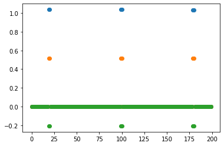
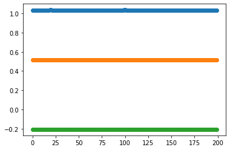

.. code:: ipython3

    import numpy as np
    from matplotlib import pyplot as plt

.. code:: ipython3

    x = np.array([0.   , 0.   , 0.   , 0.   , 0.   , 0.   , 0.   , 0.   , 0.   ,
           0.   , 0.   , 0.   , 0.   , 0.   , 0.   , 0.   , 0.   , 0.   ,
           0.   , 1.038, 1.038, 0.   , 0.   , 0.   , 0.   , 0.   , 0.   ,
           0.   , 0.   , 0.   , 0.   , 0.   , 0.   , 0.   , 0.   , 0.   ,
           0.   , 0.   , 0.   , 0.   , 0.   , 0.   , 0.   , 0.   , 0.   ,
           0.   , 0.   , 0.   , 0.   , 0.   , 0.   , 0.   , 0.   , 0.   ,
           0.   , 0.   , 0.   , 0.   , 0.   , 0.   , 0.   , 0.   , 0.   ,
           0.   , 0.   , 0.   , 0.   , 0.   , 0.   , 0.   , 0.   , 0.   ,
           0.   , 0.   , 0.   , 0.   , 0.   , 0.   , 0.   , 0.   , 0.   ,
           0.   , 0.   , 0.   , 0.   , 0.   , 0.   , 0.   , 0.   , 0.   ,
           0.   , 0.   , 0.   , 0.   , 0.   , 0.   , 0.   , 0.   , 0.   ,
           1.038, 1.038, 0.   , 0.   , 0.   , 0.   , 0.   , 0.   , 0.   ,
           0.   , 0.   , 0.   , 0.   , 0.   , 0.   , 0.   , 0.   , 0.   ,
           0.   , 0.   , 0.   , 0.   , 0.   , 0.   , 0.   , 0.   , 0.   ,
           0.   , 0.   , 0.   , 0.   , 0.   , 0.   , 0.   , 0.   , 0.   ,
           0.   , 0.   , 0.   , 0.   , 0.   , 0.   , 0.   , 0.   , 0.   ,
           0.   , 0.   , 0.   , 0.   , 0.   , 0.   , 0.   , 0.   , 0.   ,
           0.   , 0.   , 0.   , 0.   , 0.   , 0.   , 0.   , 0.   , 0.   ,
           0.   , 0.   , 0.   , 0.   , 0.   , 0.   , 0.   , 0.   , 0.   ,
           0.   , 0.   , 0.   , 0.   , 0.   , 0.   , 0.   , 0.   , 1.032,
           1.032, 0.   , 0.   , 0.   , 0.   , 0.   , 0.   , 0.   , 0.   ,
           0.   , 0.   , 0.   , 0.   , 0.   , 0.   , 0.   , 0.   , 0.   ,
           0.   , 0.   ])
    
    
    aux = np.array([x.copy(), x.copy()*0.5, x.copy()*-0.2])
    aux.shape

.. parsed-literal::

    (3, 200)

.. code:: ipython3

    plt.plot(aux.T, 'o')

.. parsed-literal::

    [<matplotlib.lines.Line2D at 0x7fbf3bbc1790>,
     <matplotlib.lines.Line2D at 0x7fbf3bbc17f0>,
     <matplotlib.lines.Line2D at 0x7fbf3bbc1880>]

.. code:: ipython3

    aux[:, np.argwhere(aux.sum(axis=0) == 0).T[0]] = np.nan
    nans, x= np.isnan(aux), lambda z: z.nonzero()[0]
    aux[nans]= np.interp(x(nans), x(~nans), aux[~nans])

.. code:: ipython3

    plt.plot(aux.T, 'o')

.. parsed-literal::

    [<matplotlib.lines.Line2D at 0x7fbf3bbeae20>,
     <matplotlib.lines.Line2D at 0x7fbf3bbeaf70>,
     <matplotlib.lines.Line2D at 0x7fbf3bbeaac0>]

