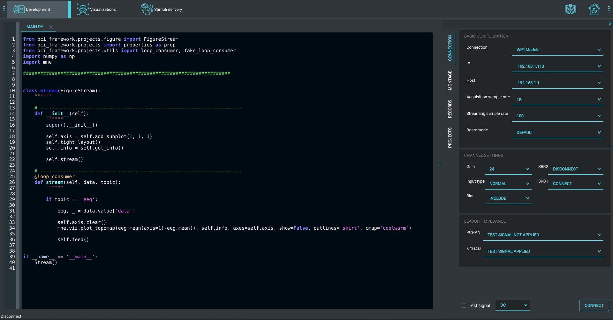

BCI-Framework
=============

A distributed processing tool, stimuli delivery, psychophysiological
experiments designer and real-time visualizations for OpenBCI.

|image0| |image1| |image2|

.. |image1| image:: images/Peek_2020-08-17_20-58.gif
.. |image2| image:: images/Peek_2020-08-17_20-54.gif

**Under hard development right now**
